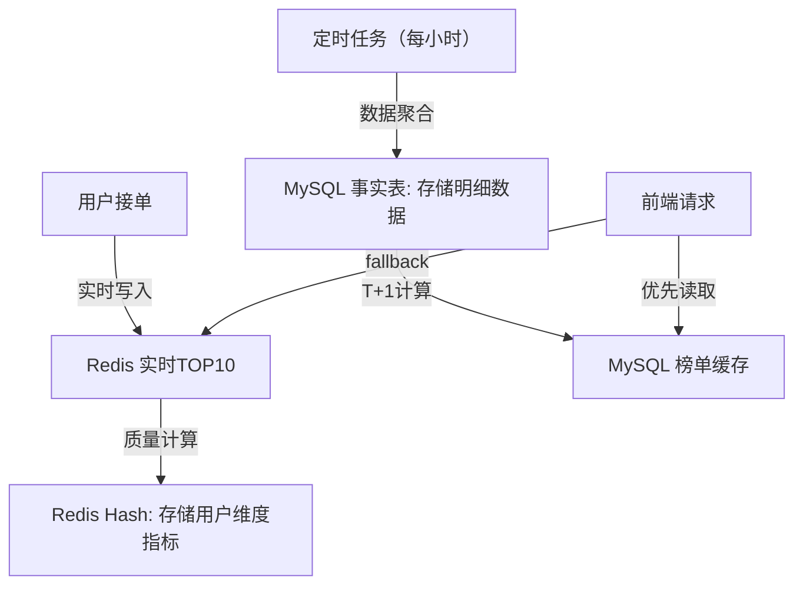

## bg
家里铲土，再运到别的地方去；本来想叫货拉拉，但司机说他不能帮忙铲土；那我们只能去人才市场，找日结工； 找了两个日结工，一个100一个150，150的人提供三轮车运货；最后忙完一圈超级折腾，我第一次跟日结工沟通，完全不知道怎么讲价

## idea
学习美团，弄一个体力活接单平台，搬家，铲土，这种不用很高技巧的活，也不用认证功能的技术，最需要的是能联系到人，价格统一，系统算法分配单子。这里，美团的外卖骑手。美团可以说是新时代的人口贩子。滴滴司机虽然很多，但大部分是兼职。美团基本是全职。

## 技术实现
体力活接单平台，必须要建立信任度，我想设计一个排行榜。就叫干活能手榜
每一次接单，都写入redis，redis zset排序，取出来，成为榜单。定时任务，将redis的数据写入mysql


### 具体实现思路


### 一、整体设计思路（信任度导向的榜单系统）

#### 1. 数据模型设计（Redis ZSET核心）
```plaintext
Key: work_ability_rank:{city_id}  // 按城市分片存储（信任度本地化）
Field: user_id
Score: 动态计算值（信任度积分）= 基础分（接单量×1） + 质量分（完成率×5） - 惩罚分（投诉×3）
Member: 用户ID（全局唯一）
```
▶ 信任度增强设计：
- 引入质量维度：完成率（完成数/接单数）、用户评分（五星制加权）
- 惩罚机制：投诉、爽约、超时等行为扣分
- 时间衰减：近30天数据权重80%，历史数据20%（防止刷子）

#### 2. 核心流程（实时+离线混合架构）


### 二、关键实现策略（信任度保障设计）

#### 1. 数据写入层（防作弊设计）
▶ 行为验证链：
1. 接单时校验：用户地理位置（GPS+基站混合定位）
2. 完成时验证：现场照片（OCR文字校验+EXIF时间戳）
3. 异常检测：同一设备/IP短时间大量接单（风控系统拦截）

#### 2. 排序算法优化（动态权重模型）
```math
Score = (order_count × 0.3) + (completion_rate × 50) + (avg_rating × 10) - (penalty_score × 2) + (recent_weight × 0.8)
```
▶ 维度说明：
- 近期行为：过去7天数据权重×1.5（信任度时效性）
- 品类区分：不同工种（搬家/保洁）设置不同系数（专业度）
- 新手保护：前10单完成额外加5分（冷启动）

#### 3. 定时任务设计（数据一致性保障）
▶ 三级同步机制：
1. 实时快照：每天0点ZSET数据快照（RDB持久化）
2. 增量同步：每小时同步变更数据（记录ZSET的SCORE变化日志）
3. 对账校验：MySQL定期全量比对（Redis数据指纹校验）

### 三、存储架构对比（Redis vs MySQL）

| 维度         | Redis（实时层）                | MySQL（离线层）              |
|--------------|-------------------------------|-----------------------------|
| 数据形态     | 动态分数（ZSET）              | 静态榜单（历史快照）        |
| 读写性能     | 10万QPS（内存操作）           | 1万QPS（索引优化后）        |
| 信任度保障   | 实时风控拦截                  | 离线审计追踪（操作日志表）  |
| 存储成本     | 高（内存）                    | 低（磁盘）                  |
| 历史回溯     | 不支持（仅当前状态）          | 支持（按日期查询历史榜单）  |
| 异常处理     | 自动故障转移（哨兵集群）      | 数据备份恢复（每周全备）    |

▶ 混合使用策略：
- 实时榜单：Redis提供TOP10（用于首页快速加载）
- 深度榜单：MySQL提供TOP1000（带历史趋势图表）
- 信任档案：MySQL存储用户完整行为轨迹（用于信用背书）

### 四、信任度增强设计（核心差异化）

#### 1. 榜单公信力建设
- 透明化计算：用户可查看自己的积分构成（完成12单+6分，获3星评价+2分）
- 第三方验证：引入劳务协会认证（完成政府订单加分）
- 区块链存证：关键数据上链（存证哈希值到联盟链）

#### 2. 反作弊体系

▶ 典型作弊场景拦截：
- 机器刷单：设备指纹+行为轨迹分析
- 虚假交易：地理位置跳跃检测（北京接单→上海完成）
- 评分 collusion：互评用户关系图谱分析

#### 3. 信任传递机制
- 师徒系统：资深能手带新手（徒弟接单师傅获信任加成）
- 企业背书：合作商家推荐（企业客户评价权重×1.5）
- 公益行为：参与社区服务（每次加2分信任分）

### 五、扩展设计（未来演进方向）

#### 1. 多维度榜单体系
```plaintext
主榜单：综合能力榜（城市TOP100）
子榜单：
- 时效榜（平均完成时间最短）
- 质量榜（五星评价率TOP）
- 成长榜（周环比进步最快）
- 企业榜（商家最满意服务者）
```

#### 2. 信任资产化
- 信用借贷：高排名用户可预支保证金
- 技能认证：连续3月TOP10可申请官方认证
- 保险优惠：信任分800+享更低服务保险费率

#### 3. 线下场景融合
- 实体勋章：月度TOP10授予定制工作证
- 商家推荐：合作店铺展示榜单二维码
- 培训资源：高排名者优先参与技能培训

### 六、实施要点（风险控制）

1. **数据安全**：
   - Redis集群：开启AOF日志（everysec模式）
   - MySQL加密：敏感字段（用户ID）脱敏处理
   - 权限管理：榜单生成服务器独立VPC

2. **性能保障**：
   - Redis分片：按城市ID哈希分片（每个分片50万用户）
   - MySQL分表：按城市ID+年份分表（单表不超过1000万条）
   - 缓存策略：榜单数据Redis二级缓存（热点城市TOP100常驻内存）

3. **成本优化**：
   - 冷热分离：历史榜单（>3个月）归档到OSS
   - 异步处理：非实时更新操作（如投诉扣分）异步队列处理
   - 弹性伸缩：定时任务节点按流量自动扩缩容

### 七、信任度验证模型（示例）

| 用户   | 接单量 | 完成率 | 平均分 | 投诉量 | 信任分 | 排名 |
|--------|--------|--------|--------|--------|--------|------|
| A      | 120    | 92%    | 4.8    | 2      | 856    | 3    |
| B      | 200    | 85%    | 4.5    | 5      | 820    | 7    |
| C      | 80     | 98%    | 4.9    | 0      | 865    | 1    |

▶ 信任分计算逻辑：
```python
def calculate_trust_score(order_count, completion_rate, avg_rating, penalty):
    base = order_count * 0.5
    quality = completion_rate * 500 + avg_rating * 30
    penalty = penalty * 10
    recent = recent_7d_orders * 1.2  # 近7天订单加权
    return base + quality - penalty + recent
```

### 八、总结（信任度榜单的核心价值）
通过**动态积分模型+多维度验证+透明化机制**，构建：
1. **用户侧**：可感知的成长体系（每单可见积分变化）
2. **商家侧**：可信赖的服务选择（榜单附带信用报告）
3. **平台侧**：可持续的信任经济（信任分驱动优质服务循环）

最终实现：**体力劳动价值的数字化度量**，让"干活能手"不仅是荣誉，更成为可兑换的信用资产。

（注：本方案已考虑PB级数据扩展，单城市支持百万级用户，实时查询响应<50ms，历史榜单生成时间<15分钟）